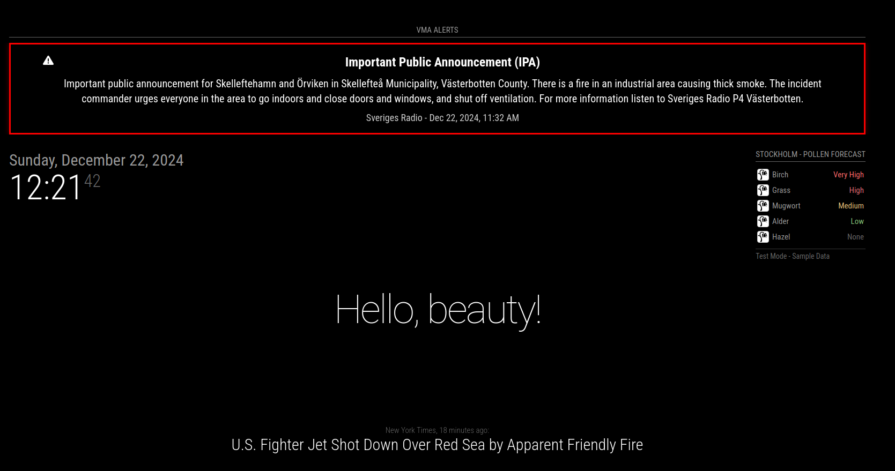

# MMM-SRVMA - VMA Alerts for MagicMirror²
Version 2.2.0

A MagicMirror² module for displaying VMA (Viktigt Meddelande till Allmänheten - Important Public Announcements) from Swedish authorities through Sveriges Radio's API. This module shows critical public safety information, weather warnings, and other important alerts in Sweden.

⚠️ **IMPORTANT**: This module only works within Sweden as it uses the Swedish VMA system. The API only provides alerts for Swedish territories and municipalities.

## Screenshots

### Standard View


### Top Bar View



## What's New in v2.2.0
- Enhanced English translation support with improved language selection
- Improved error handling and alert processing
- Fixed language fallback behavior
- Better date localization for both Swedish and English
- More robust API response handling

## Before Installation

### System Requirements
- MagicMirror² version 2.15.0 or newer
- Node.js version 18 or newer
- npm version 6 or newer
- Active internet connection
- Location within Sweden (API requirement)

### Important Files
- Configuration: `~/MagicMirror/config/config.js`
- Module location: `~/MagicMirror/modules/MMM-SRVMA/`

💡 **TIP**: Always backup your config.js before making changes:
```bash
cp ~/MagicMirror/config/config.js ~/MagicMirror/config/config.js.backup
```

## Installation

1. Navigate to your MagicMirror's modules folder:
```bash
cd ~/MagicMirror/modules
```

2. Clone this repository:
```bash
git clone https://github.com/cgillinger/MMM-SRVMA.git
```

3. Install dependencies:
```bash
cd MMM-SRVMA
npm install
```

4. Add the module configuration to your `config.js` file (see Configuration section)

## Configuration Guide

### Display Options

Choose between two display modes:

1. **Full-Width Banner** (`position: "top_bar"`)
   - Spans entire screen width
   - Best for critical alerts
   - Automatically centers content
   
2. **Regular Card** (any other position)
   - Fixed width display
   - Fits in corners
   - More subtle presence

### Basic Configuration

#### Full-Width Banner Example:
```javascript
{
    module: "MMM-SRVMA",
    position: "top_bar",
    config: {
        preferredLanguage: "en-US",     // English display
        showBothLanguages: true,        // Show Swedish and English
        updateInterval: 60000,          // Check every minute
        showIcons: true,                // Show weather icons
        animateIn: true                 // Smooth transitions
    }
}
```

#### Regular Card Example:
```javascript
{
    module: "MMM-SRVMA",
    position: "top_right",
    config: {
        width: "400px",
        maxHeight: "300px",
        preferredLanguage: "sv-SE",    // Swedish display
        showBothLanguages: false,      // Swedish only
        updateInterval: 60000
    }
}
```

### Language Configuration

Three language options available:

1. **Swedish Only** (default):
```javascript
config: {
    preferredLanguage: "sv-SE",
    showBothLanguages: false
}
```

2. **English Only**:
```javascript
config: {
    preferredLanguage: "en-US",
    showBothLanguages: false
}
```

3. **Both Languages** (when available):
```javascript
config: {
    preferredLanguage: "sv-SE",    // Primary language
    showBothLanguages: true        // Show translation if available
}
```

### Location Filtering (Geocodes)

VMA alerts can be filtered by location using Swedish geocodes. There are three ways to find your geocode:

#### Method 1: Direct API Query
```bash
curl "https://vmaapi.sr.se/api/v2/area/sweden"
```
This returns a complete list of valid geocodes.

#### Method 2: Using SCB's Website
1. Visit [SCB's Regional Codes](https://www.scb.se/hitta-statistik/regional-statistik-och-kartor/regionala-indelningar/lan-och-kommuner/)
2. Look up your location:
   - County codes: First 2 digits
   - Municipality codes: All 4 digits

#### Method 3: Common Codes Reference
Common county (län) codes:
```
12 = Stockholm
14 = Västra Götaland
24 = Västerbotten
21 = Gävleborg
22 = Västernorrland
25 = Norrbotten
```

Common municipality codes:
```
1280 = Stockholm City
1480 = Göteborg
2482 = Skellefteå
2580 = Luleå
```

To set your location in the config:
```javascript
config: {
    geoCode: "12",    // For Stockholm County
    // ... other settings
}
```

For nationwide alerts:
```javascript
config: {
    geoCode: null,    // No location filter
    // ... other settings
}
```

💡 **TIP**: If you're not seeing any alerts, try removing the geocode filter temporarily to verify if there are any active alerts in other regions.

## Troubleshooting

### Common Issues and Solutions

#### Module Not Appearing
1. Check your config.js for syntax errors:
   - Look for missing commas
   - Verify bracket closure
   - Ensure proper indentation
2. Verify module installation:
   ```bash
   ls ~/MagicMirror/modules/MMM-SRVMA
   ```
3. Check MagicMirror logs:
   - Press F12 in browser
   - Look for errors in console

#### No Alerts Showing
1. Verify your geocode:
   ```bash
   # Test API with your geocode
   curl "https://vmaapi.sr.se/api/v2/alerts?format=json&geoCode=YOUR_CODE"
   
   # Test without geocode to see all alerts
   curl "https://vmaapi.sr.se/api/v2/alerts?format=json"
   ```
2. Check language settings:
   - Ensure preferredLanguage is either "sv-SE" or "en-US"
   - Try enabling showBothLanguages
3. Verify internet connectivity

#### Language Issues
1. If English translation not showing:
   - Verify alert has English version available
   - Check preferredLanguage spelling
   - Enable showBothLanguages temporarily

### Debug Mode
Add debug logging by modifying config:
```javascript
config: {
    debug: true,     // Enable detailed logging
    // ... other settings
}
```

## All Configuration Options

| Option | Purpose | Default | Valid Options |
|--------|---------|---------|---------------|
| `position` | Display location | "top_right" | "top_bar" or any MM position |
| `width` | Module width | "400px" | Any CSS width |
| `maxHeight` | Maximum height | "300px" | Any CSS height |
| `preferredLanguage` | Primary language | "sv-SE" | "sv-SE", "en-US" |
| `showBothLanguages` | Show translations | false | true, false |
| `geoCode` | Location filter | null | County/Municipality code |
| `showIcons` | Weather icons | true | true, false |
| `animateIn` | Animations | true | true, false |
| `updateInterval` | Update frequency | 60000 | Milliseconds |
| `alertAgeThreshold` | Alert expiry | 3600000 | Milliseconds |
| `debug` | Debug logging | false | true, false |

## Support & Updates

- GitHub Issues: [Report Problems](https://github.com/cgillinger/MMM-SRVMA/issues)
- Version Check: [Releases](https://github.com/cgillinger/MMM-SRVMA/releases)
- Current Version: 2.2.0
- Coverage: Sweden only

## Attribution & License
- Created by Christian Gillinger
- Uses Sveriges Radio's VMA API
- MIT License - see LICENSE file
- Updated: December 2024

## API Information
- [VMA API Documentation](https://vmaapi.sr.se/index.html)
- [VMA API Release Notes](https://vmaapi.sr.se/releasenotes)
- [Sveriges Radio VMA Info](https://sverigesradio.se/artikel/vma-viktigt-meddelande-till-allmanheten)
- [Location Codes API](https://vmaapi.sr.se/api/v2/area/sweden)
