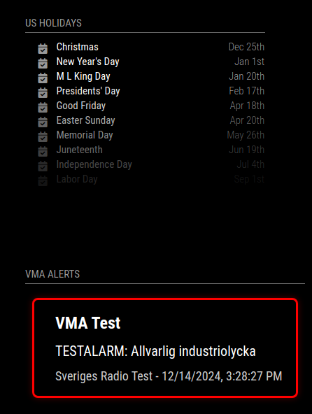

# MMM-SRVMA - VMA Alerts for MagicMirror²

A MagicMirror² module for displaying VMA (Viktigt Meddelande till Allmänheten - Important Public Announcements) from Swedish authorities through Sveriges Radio's API. This module shows critical public safety information, weather warnings, and other important alerts in Sweden.



## API Attribution
This module uses the VMA API service provided by Sveriges Radio AB. The VMA system is owned and operated by Sveriges Radio AB on behalf of Swedish authorities. For more information about the VMA service, visit:
- [VMA API Documentation](https://vmaapi.sr.se/index.html)
- [VMA API Release Notes](https://vmaapi.sr.se/releasenotes)
- [Sveriges Radio VMA Information](https://sverigesradio.se/artikel/vma-viktigt-meddelande-till-allmanheten)

## English 🇬🇧

### Description
This module displays Swedish VMA (Important Public Announcements) on your MagicMirror. It shows different types of alerts with color-coding based on severity:
- Red: Severe alerts (like industrial accidents)
- Orange: Moderate alerts (like severe weather warnings)
- Yellow: Minor alerts (like traffic disruptions)

### Installation
1. Navigate to your MagicMirror's modules folder:
```bash
cd ~/MagicMirror/modules
```

2. Clone this repository:
```bash
git clone https://github.com/cgillinger/MMM-SRVMA
```

3. Install dependencies:
```bash
cd MMM-SRVMA
npm install
```

### Configuration
Add this to your `config/config.js` file:
```javascript
{
    module: "MMM-SRVMA",
    position: "top_right",
    config: {
        // Basic settings
        updateInterval: 60000,         // Update every minute
        alertAgeThreshold: 3600000,    // Show alerts from the last hour (1 hour in ms)
        width: "400px",               // Adjust width as needed
        maxHeight: "300px",           // Adjust max height as needed
        showIcons: true,
        animateIn: true,
        geoCode: "12",                // Location filter (e.g., "12" for Stockholm County)
        preferredLanguage: "sv-SE",    // Language setting ("sv-SE" for Swedish, "en-US" for English)
        showBothLanguages: false       // Set to true to show both Swedish and English when available
    }
}
```

### Location Filtering
The module supports location-based filtering using Swedish GeoCodes:
- `geoCode`: 
  - Two digits for counties (län), e.g., "12" for Stockholm County
  - Four digits for municipalities (kommuner), e.g., "1280" for Stockholm Municipality
  - When using a county code, you'll also receive alerts for all municipalities within that county
  - Leave empty or omit to receive alerts for all of Sweden

Example for Stockholm County:
```javascript
config: {
    geoCode: "12",    // Filter alerts for Stockholm County and its municipalities
    preferredLanguage: "sv-SE"
}
```

Example for Stockholm Municipality:
```javascript
config: {
    geoCode: "1280",  // Filter alerts only for Stockholm Municipality
    preferredLanguage: "sv-SE"
}
```

### Language Settings
The module supports dual-language display with these options:
- `preferredLanguage`: 
  - Use `"sv-SE"` for Swedish (default)
  - Use `"en-US"` for English
- `showBothLanguages`: 
  - Set to `true` to display both languages when available
  - Set to `false` to show only preferred language (default)

Example for English with both languages shown:
```javascript
config: {
    preferredLanguage: "en-US",    // Show English as primary language
    showBothLanguages: true        // Also show Swedish text when available
}
```

Example for Swedish only:
```javascript
config: {
    preferredLanguage: "sv-SE",    // Show Swedish only
    showBothLanguages: false       // Don't show English translations
}
```

### Test Mode
To easily test the module's appearance and functionality, you can use the built-in test mode:

1. Enable test mode in your config:
```javascript
{
    module: "MMM-SRVMA",
    position: "top_right",
    config: {
        useDummyData: true,        // Enable test mode
        dummySeverity: "Severe",   // Choose severity level
        dummyUrgency: "Immediate", // Choose urgency level
        preferredLanguage: "en-US" // Test with English
    }
}
```

2. Available test options:
- Severity levels:
  - `"Severe"` - Red alert (highest)
  - `"Moderate"` - Orange alert
  - `"Minor"` - Yellow alert (lowest)
- Urgency levels:
  - `"Immediate"` - Requires immediate attention
  - `"Expected"` - Expected in near future
  - `"Future"` - Future concern

3. Common test configurations:

Test severe alert in English:
```javascript
config: {
    useDummyData: true,
    dummySeverity: "Severe",
    preferredLanguage: "en-US"
}
```

Test moderate alert in both languages:
```javascript
config: {
    useDummyData: true,
    dummySeverity: "Moderate",
    preferredLanguage: "en-US",
    showBothLanguages: true
}
```

### Configuration Options
| Option | Description | Default | Available Values |
|--------|-------------|---------|-----------------|
| `preferredLanguage` | Primary display language | "sv-SE" | "sv-SE", "en-US" |
| `showBothLanguages` | Show both languages | false | true, false |
| `geoCode` | Location filter | null | County (2 digits) or Municipality (4 digits) code |
| `useDummyData` | Enable test mode | false | true, false |
| `dummySeverity` | Test alert severity | "Severe" | "Severe", "Moderate", "Minor" |
| `dummyUrgency` | Test alert urgency | "Immediate" | "Immediate", "Expected", "Future" |
| `updateInterval` | Update frequency (ms) | 60000 | any number |
| `alertAgeThreshold` | Max alert age (ms) | 3600000 | any number |
| `width` | Module width | "400px" | any valid CSS width |
| `maxHeight` | Module max height | "300px" | any valid CSS height |
| `showIcons` | Display alert icons | true | true, false |
| `animateIn` | Enable animations | true | true, false |

## Svenska 🇸🇪

### Beskrivning
Denna modul visar VMA (Viktigt Meddelande till Allmänheten) på din MagicMirror. Den använder Sveriges Radios VMA-API för att hämta och visa viktiga meddelanden. Varningar visas med färgkodning baserat på allvarlighetsgrad:
- Röd: Allvarliga varningar (som industriolyckor)
- Orange: Måttliga varningar (som vädervarningar)
- Gul: Mindre allvarliga varningar (som trafikstörningar)

### Installation
1. Navigera till din MagicMirror's modules-mapp:
```bash
cd ~/MagicMirror/modules
```

2. Klona detta repository:
```bash
git clone https://github.com/chrillgi/MMM-SRVMA
```

3. Installera beroenden:
```bash
cd MMM-SRVMA
npm install
```

### Grundkonfiguration
Lägg till detta i din `config/config.js` fil:
```javascript
{
    module: "MMM-SRVMA",
    position: "top_right",
    config: {
        // Grundinställningar
        updateInterval: 60000,         // Uppdatera varje minut
        alertAgeThreshold: 3600000,    // Visa varningar från senaste timmen
        width: "400px",               // Justera bredd efter behov
        maxHeight: "300px",           // Justera maxhöjd efter behov
        showIcons: true,              // Visa ikoner
        animateIn: true,              // Aktivera animationer
        geoCode: "12",                // Platsfilter (t.ex. "12" för Stockholms län)
        preferredLanguage: "sv-SE",    // Språkinställning
        showBothLanguages: false       // Visa båda språken
    }
}
```

### Platsfiltrering
Modulen stöder platsbaserad filtrering med svenska GeoCodes:
- `geoCode`: 
  - Två siffror för län, t.ex. "12" för Stockholms län
  - Fyra siffror för kommuner, t.ex. "1280" för Stockholms kommun
  - När du använder en länskod får du även varningar för alla kommuner inom länet
  - Lämna tomt eller utelämna för att få varningar för hela Sverige

Exempel för Stockholms län:
```javascript
config: {
    geoCode: "12",    // Filtrera varningar för Stockholms län och dess kommuner
    preferredLanguage: "sv-SE"
}
```

Exempel för Stockholms kommun:
```javascript
config: {
    geoCode: "1280",  // Filtrera varningar endast för Stockholms kommun
    preferredLanguage: "sv-SE"
}
```

### Språkinställningar
Modulen stöder visning på två språk med följande alternativ:
- `preferredLanguage`: 
  - Använd `"sv-SE"` för svenska (standard)
  - Använd `"en-US"` för engelska
- `showBothLanguages`: 
  - Sätt till `true` för att visa både svenska och engelska
  - Sätt till `false` för att bara visa valt språk (standard)

Exempel för svenska med engelska översättningar:
```javascript
config: {
    preferredLanguage: "sv-SE",    // Visa svenska som huvudspråk
    showBothLanguages: true        // Visa även engelska översättningar
}
```

### Testläge
För att enkelt testa modulens utseende och funktionalitet kan du använda det inbyggda testläget:

1. Aktivera testläge i din konfiguration:
```javascript
{
    module: "MMM-SRVMA",
    position: "top_right",
    config: {
        useDummyData: true,        // Aktivera testläge
        dummySeverity: "Severe",   // Välj allvarlighetsgrad
        dummyUrgency: "Immediate", // Välj prioritetsnivå
        preferredLanguage: "sv-SE" // Testa på svenska
    }
}
```

2. Tillgängliga testalternativ:
- Allvarlighetsgrader:
  - `"Severe"` - Röd varning (högst)
  - `"Moderate"` - Orange varning
  - `"Minor"` - Gul varning (lägst)
- Prioritetsnivåer:
  - `"Immediate"` - Kräver omedelbar uppmärksamhet
  - `"Expected"` - Förväntas inom kort
  - `"Future"` - Framtida händelse

### Konfigurationsalternativ
| Alternativ | Beskrivning | Standard | Tillgängliga värden |
|------------|-------------|----------|-------------------|
| `preferredLanguage` | Primärt visningsspråk | "sv-SE" | "sv-SE", "en-US" |
| `showBothLanguages` | Visa båda språken | false | true, false |
| `geoCode` | Platsfilter | null | Län (2 siffror) eller kommun (4 siffror) kod |
| `useDummyData` | Aktivera testläge | false | true, false |
| `dummySeverity` | Testvarningens allvarlighetsgrad | "Severe" | "Severe", "Moderate", "Minor" |
| `dummyUrgency` | Testvarningens prioritet | "Immediate" | "Immediate", "Expected", "Future" |
| `updateInterval` | Uppdateringsfrekvens (ms) | 60000 | valfritt nummer |
| `alertAgeThreshold` | Max ålder på varningar (ms) | 3600000 | valfritt nummer |
| `width` | Modulbredd | "400px" | valfri CSS-bredd |
| `maxHeight` | Modulens maxhöjd | "300px" | valfri CSS-höjd |
| `showIcons` | Visa varningsikoner | true | true, false |
| `animateIn` | Aktivera animationer | true | true, false |

## Support
För support, vänligen öppna ett ärende på GitHub.

## Attribution and License
- This module is created by Christian Gillinger under the MIT License
- VMA API service is provided by Sveriges Radio AB
- MagicMirror² is an open source project

## License
MIT License - see LICENSE file for details
